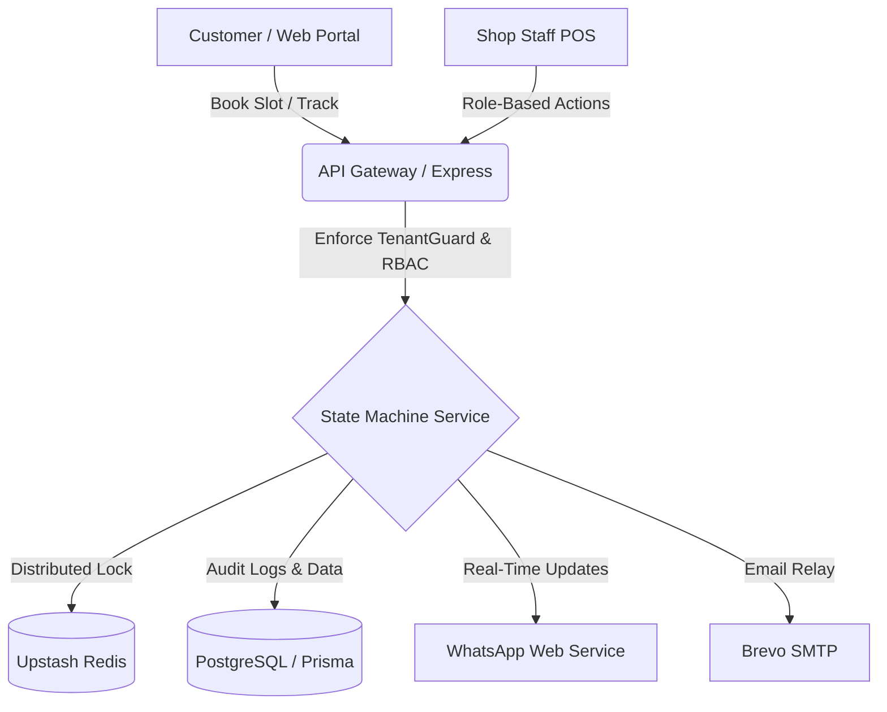
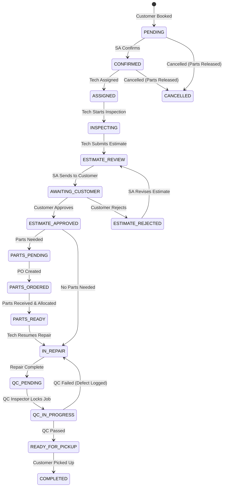

# BayFlow — Multi-Tenant Auto Repair Shop Management Platform

> **Hackathon Submission Brief Version 1.1**  
> Complete Customer Booking Portal &bull; Shop POS &bull; Role-Based 15-State Repair Lifecycle Workflow &bull; Multi-Channel Notifications (WhatsApp + Brevo Email)

---

## 🚀 Live Demo & Documentation

- **Swagger / OpenAPI Interactive Docs**: `http://localhost:4000/api/docs`
- **Customer Portal & POS Web App**: `http://localhost:3000`
- **WhatsApp Webhook / QR Management**: `http://localhost:3000/owner/whatsapp`

---

## 👥 Demo Credentials for All Roles

All demo accounts are pre-configured in `Backend/prisma/seed.ts`. Use password: `demo1234`

| Role | Email | Password | Shop / Tenant | Scope & Capabilities |
|---|---|---|---|---|
| **Shop Owner** | `fatima@bayflow.demo` | `demo1234` | Lahore Auto Care | Shop setup, staff management, inventory & POs, analytics |
| **Service Advisor** | `bilal.sa@bayflow.demo` | `demo1234` | Lahore Auto Care | Intake, technician assignment, estimate review, customer liaison |
| **Technician** | `imran.tech@bayflow.demo` | `demo1234` | Lahore Auto Care | Assigned repairs, inspection, estimate drafting, parts requests |
| **Parts Person** | `usman.parts@bayflow.demo` | `demo1234` | Lahore Auto Care | Inventory catalog, shortage checks, purchase orders, parts receiving & allocation |
| **Quality Inspector (QC)** | `sara.qc@bayflow.demo` | `demo1234` | Lahore Auto Care | Post-repair inspection, pass to pickup, or log defects back to repair |
| **Customer** | `ahmed.customer@bayflow.demo` | `demo1234` | — | Shop discovery, slot booking, live tracking, estimate approval/rejection |

---

## 🛠️ Tech Stack & Architecture

- **Backend**: Node.js, Express, TypeScript, Prisma ORM
- **Database**: PostgreSQL (Supabase Connection Pooling)
- **Caching & Concurrency Locking**: Upstash Redis (Distributed Locks for Double-Booking & QC race prevention)
- **Frontend**: Next.js 14+ (App Router), React, TailwindCSS, Lucide Icons
- **Notifications**: Multi-channel (WhatsApp via `whatsapp-web.js` + Brevo SMTP Email Relay)
- **API Spec**: OpenAPI 3.0 via Swagger UI Express



---

## 🔄 Repair Lifecycle State Machine

BayFlow strictly enforces all 15 states with audit trails on every transition:



---

## ⚡ Quick Start & Local Setup

### Prerequisites
- Node.js `20.x` or higher
- npm / yarn / pnpm
- PostgreSQL connection URL (or Supabase instance)
- Upstash Redis instance

### 1. Clone Repository & Install Dependencies

```bash
git clone <repository-url>
cd BayFlow-LoopLab

# Backend dependencies
cd Backend
npm install

# Frontend dependencies
cd ../Frontend
npm install
```

### 2. Environment Variables Setup

Copy `.env.example` to `Backend/.env` and update the secrets:

```bash
cp .env.example Backend/.env
```

### 3. Database Migration & Seed

Run Prisma migrations and populate the database with shops, demo roles, catalog services, and inventory items:

```bash
cd Backend
npx prisma db push
npm run seed
```

### 4. Run Locally

Start both the backend server and frontend development server:

```bash
# Terminal 1: Backend (Port 4000)
cd Backend
npm run dev

# Terminal 2: Frontend (Port 3000)
cd Frontend
npm run dev
```

Visit `http://localhost:3000` to interact with the POS and Customer portal, and `http://localhost:4000/api/docs` to test all endpoints via Swagger.

---

## 🛡️ Core Security & Concurrency Design Decisions

1. **Multi-Tenant Isolation**: Every query is scoped by `shopId` through `TenantGuard` middleware. Users cannot access cross-tenant records.
2. **Double-Booking Prevention**: Slots are protected with Redis distributed locks (`lock:slot:{shopId}:{date}:{slotTime}`) and database unique constraints.
3. **QC Concurrent Pick Protection**: Only one QC inspector can pick and evaluate a booking in `QC_IN_PROGRESS` at a time using atomic state locking.
4. **Audit Trail**: Every state transition records actor ID, previous state, new state, notes, and timestamp in `BookingHistory`.
5. **Inventory Allocation & Cancellation Protection**: Allocating parts decrements live stock and locks pricing. If a booking is cancelled, reserved parts are automatically released back into inventory.
